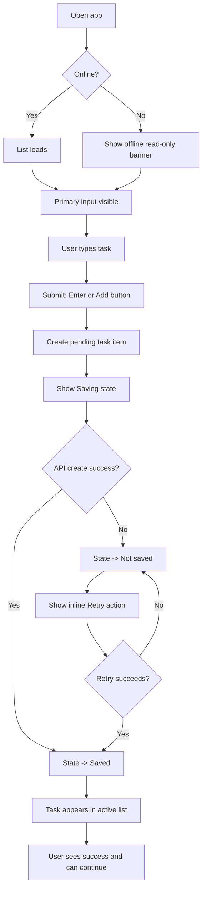
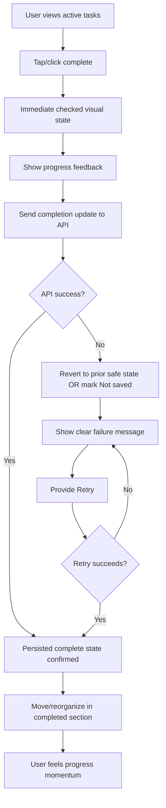
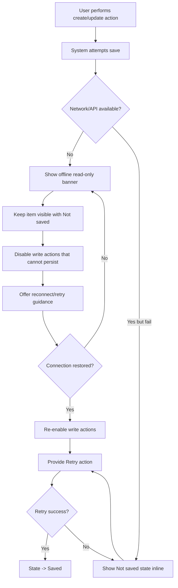

# UX Design Specification nearform-aine-bmad

**Author:** Jose
**Date:** 2026-03-31

---

<!-- UX design content will be appended sequentially through collaborative workflow steps -->

## Executive Summary

### Project Vision

nearform-aine-bmad is a focused personal todo web app designed around clarity, speed, and trust. The product intentionally avoids feature bloat and prioritizes the shortest path from opening the app to capturing and managing tasks. The core UX promise is immediate usefulness: users can add, complete, and delete todos quickly, with clear feedback and no onboarding overhead.

### Target Users

The primary users are individuals managing personal tasks in fast-moving daily contexts, often switching between moments of high urgency and short attention windows. They use a mix of mobile and desktop devices, so the experience must remain consistent and reliable across both form factors. Users expect a tool that feels lightweight and obvious rather than feature-heavy.

### Key Design Challenges

The first challenge is eliminating perceived bloat while still offering all essential task actions with clear discoverability. The second is preserving an instant-feeling interaction loop for create/complete/delete actions, including graceful recovery when network or API issues occur. The third is maintaining interaction and visual clarity across mixed device usage, ensuring parity for touch, keyboard, and pointer interactions.

### Design Opportunities

A major opportunity is creating a frictionless "time to first todo" flow, where users can capture intent within seconds of opening the app. Another is using highly legible state design (active, completed, loading, error) to build confidence and reduce user uncertainty. The strongest differentiation opportunity is disciplined UX polish at small scope: a calm, fast, trustworthy experience that feels complete without adding feature complexity.

## Core User Experience

### Defining Experience

The defining experience of nearform-aine-bmad is quick capture: users should be able to open the app and create their first todo in seconds with minimal cognitive overhead. The second critical loop is fast completion, allowing users to mark progress instantly without friction. If these two interactions feel effortless and trustworthy, the product delivers its core value.

### Platform Strategy

The product is a responsive web app, with a strict quality bar for mobile behavior and interaction polish. Mobile is treated as a first-class experience, not a scaled-down desktop layout. The product supports read-only offline behavior with a clear and explicit UX indicator, so users understand when data is stale or actions are unavailable due to connectivity.

### Effortless Interactions

Adding and completing todos must feel zero-thought and immediate. On initial load, input focus should be placed automatically on the primary capture field (where platform-appropriate) to reduce time to first action. Interaction design should minimize mode switching, avoid hidden steps, and prioritize direct manipulation with immediate visual response.

### Critical Success Moments

The key success moment is the speed and confidence of creating the first todo: users should immediately feel that the app is faster and calmer than bloated alternatives. The primary trust-breaking failure to prevent is any scenario where a todo appears created in the interface but was not actually persisted. UX feedback and state handling must make save status unambiguous at all times.

### Experience Principles

- Optimize for capture velocity: users should go from open to first todo with near-zero friction.
- Make completion feel instant: progress actions should feel immediate and satisfying.
- Design mobile-first quality: responsive behavior must be flawless on smaller touch devices.
- Be explicit about connectivity: read-only offline mode must be clearly communicated.
- Never fake persistence: UI state must never imply successful save when persistence failed.

## Desired Emotional Response

### Primary Emotional Goals

The primary emotional goal for nearform-aine-bmad is clarity: users should feel mentally lighter and immediately oriented as soon as they start using the app. The product should reinforce calm control through simple, predictable interactions that reduce cognitive noise rather than add it.

### Emotional Journey Mapping

At first discovery and first use, users should feel immediate clarity and ease, with no onboarding friction. During the core loop (capture and completion), users should feel focused momentum through fast, obvious feedback. After completing tasks, users should feel satisfaction and visible progress. If something goes wrong (such as connectivity issues), the experience should preserve trust through a gentle warning style and clear recovery paths. On return visits, users should feel continuity and confidence that the app remains dependable.

### Micro-Emotions

The most critical micro-emotions are confidence over confusion, trust over skepticism, satisfaction over frustration, and calm over overwhelm. The emotional tone should remain light and supportive, especially in edge states, so users never feel punished or stressed by the product.

### Design Implications

- Clarity -> Use minimal visual hierarchy, clear task states, and obvious primary actions with low cognitive load.
- Satisfaction and progress -> Provide immediate, legible feedback for completion actions and reinforce momentum through responsive state changes.
- Trust and confidence -> Never imply successful persistence unless confirmed; represent saving, failure, and offline read-only conditions unambiguously.
- Calm in disruption -> Use gentle warning language and non-alarming UI treatment for offline read-only and recoverable errors.
- Avoiding overwhelm -> Limit competing UI elements, reduce decision points, and keep messages concise, actionable, and contextual.

### Emotional Design Principles

- Design for cognitive calm: every screen should reduce mental clutter.
- Make progress visible: completion should feel rewarding and concrete.
- Communicate status honestly: trust comes from clear system truth, not optimistic illusion.
- Soften error moments: warning and recovery should feel supportive, not punitive.
- Protect user focus: avoid patterns that create noise, urgency pressure, or overwhelm.

## UX Pattern Analysis & Inspiration

### Inspiring Products Analysis

**Apple Reminders**
Apple Reminders demonstrates a calm, low-friction experience that emphasizes clarity and trust. The interface keeps visual noise minimal, task state is easy to read, and completion interactions feel immediate and satisfying. It handles recurring usage well through predictable structure and a sense of continuity that helps users trust their data over time.

**Todoist**
Todoist is strong at fast capture and clear task flow, especially around quick-add and lightweight organization. It balances action density with readability, helping users move from intent to recorded task quickly. Its interaction model reinforces momentum, making task creation and completion feel like a continuous, efficient loop.

Across both products, the strongest shared value is reducing cognitive overhead while keeping state changes obvious and dependable.

### Transferable UX Patterns

**Navigation Patterns**
- Single-primary-surface pattern: center the list and input as the dominant interface, reducing secondary navigation noise.
- Progressive disclosure pattern: keep advanced capabilities hidden until needed, preserving clarity for core capture/complete flows.

**Interaction Patterns**
- Immediate capture affordance: persistent, obvious entry point for adding tasks with minimal steps.
- Instant completion feedback: completion actions should produce fast, legible visual transitions that reinforce progress.
- Truthful status transitions: loading/saving/offline states are explicit and understandable, never ambiguous.

**Visual Patterns**
- Calm visual hierarchy: restrained typography, spacing, and contrast to reduce overwhelm and support scanning.
- Strong state distinction: active vs completed styling should be unmistakable at a glance across mobile and desktop.
- Gentle system messaging: warnings and edge-state notices should be informative and non-punitive in tone.

### Anti-Patterns to Avoid

- Overloaded first screen with filters, metadata, and controls that delay time to first todo.
- Ambiguous save behavior where tasks appear persisted before confirmation, damaging trust.
- Overly aggressive error treatments (blocking modals, alarming language) for recoverable connectivity issues.
- Dense, tiny interaction targets that degrade usability on mobile.
- Hidden or inconsistent completion controls that make progress feel uncertain.

### Design Inspiration Strategy

**What to Adopt**
- Adopt Apple Reminders-like calm presentation and strong visual state clarity to support emotional goals of clarity and low overwhelm.
- Adopt Todoist-like quick capture flow and momentum-oriented completion interactions to support core experience goals.

**What to Adapt**
- Adapt quick-add patterns to a stricter minimal scope so speed is preserved without introducing feature bloat.
- Adapt status messaging patterns to include explicit read-only offline indicators with gentle warning tone.

**What to Avoid**
- Avoid multi-pane or feature-heavy layouts that compete with the capture/completion loop.
- Avoid optimistic UI patterns that imply successful persistence without clear confirmation and recoverable fallback states.

## Design System Foundation

### 1.1 Design System Choice

Use an established design system as the core foundation for nearform-aine-bmad, with a deliberate customization layer focused on high-impact brand and interaction differentiation.

### Rationale for Selection

The project needs a trustworthy, polished, and mobile-flawless UX quickly, and an established system provides mature components, accessibility defaults, and implementation speed. Although uniqueness is a high priority, current brand constraints are minimal, which creates room to introduce differentiation through interaction polish, motion, spacing rhythm, and tone rather than full component reinvention. With a high-skill team, this approach minimizes risk while still enabling a distinct product feel where it matters most (capture speed, completion feedback, trust states).

### Implementation Approach

Adopt the established system for foundational UI primitives first (layout, typography scale, form controls, buttons, feedback states, and responsive breakpoints). Build core todo flows using stock components early to validate interaction speed and reliability on mobile and desktop. Then introduce a thin custom layer for signature moments: quick-capture input behavior, completion micro-feedback, and explicit offline read-only indicators. Keep custom components limited to UX-critical areas to avoid bloating scope and maintenance overhead.

### Customization Strategy

Prioritize customization in this order:
1. **Interaction behavior** (fast capture, completion feedback, save-state clarity) before visual ornament.
2. **Design tokens** (color, spacing, radius, typography tuning) to create a distinct but calm visual identity.
3. **State language and messaging tone** (gentle warning, trust-building status communication).
4. **Selective component overrides** only where stock patterns conflict with clarity, speed, or low-overwhelm goals.

Avoid broad aesthetic over-customization that increases complexity without improving core user outcomes.

## 2. Core User Experience

### 2.1 Defining Experience

The defining experience of nearform-aine-bmad is: users can capture tasks in seconds and trust they are really saved. The product succeeds when task capture feels immediate and completion feels frictionless, while persistence status remains transparent and reliable. This creates a calm productivity loop built on speed and honesty rather than feature depth.

### 2.2 User Mental Model

Users approach the product with a simple list mindset: "I need to write this down now, then mark it done when finished." They expect direct interaction with minimal ceremony, similar to quick note-taking. On desktop, they expect fast keyboard flow (single-line input + Enter). On mobile, they expect equivalent speed through a prominent input and touch-friendly controls without requiring keyboard-heavy behavior. Their biggest trust expectation is that what appears in the list reflects real saved state.

### 2.3 Success Criteria

The core experience is successful when:
- Users can create a task from the main screen in one focused action path.
- Single-line quick capture works seamlessly, with Enter-to-save on keyboard contexts.
- Mobile users can capture with equal speed using touch-first affordances.
- Completing a task gives immediate confirmation through both state change and list organization cues.
- If persistence fails, the item remains visible with explicit "Not saved" status and clear retry action.
- Users never need to guess whether a task is actually saved.

### 2.4 Novel UX Patterns

This experience primarily uses established, familiar UX patterns (single-field capture, inline list actions, check-to-complete) to preserve learnability and speed. Innovation comes from execution quality: honest persistence signaling, blended keyboard/touch parity, and combined completion feedback (instant check plus structural movement). This is a "familiar pattern, higher-trust implementation" strategy rather than a novel interaction model requiring user education.

### 2.5 Experience Mechanics

**1. Initiation**
- User lands on the list with the primary capture field immediately visible.
- On desktop-like contexts, input focus is ready for instant typing.
- On mobile, the capture field remains highly discoverable with touch-first sizing.

**2. Interaction**
- User enters task text in a single-line input.
- Desktop/keyboard flow supports Enter-to-save.
- Mobile flow supports explicit tap-to-save with equivalent speed and clarity.
- System creates a pending/saving state tied to the item.

**3. Feedback**
- On success: item appears in active list state with clear saved confirmation.
- On completion: user sees immediate check state plus movement/organization feedback.
- On failure: item remains visible as "Not saved" with inline retry; no silent loss and no fake success.

**4. Completion**
- User sees the task in its correct persisted state.
- Completion actions reinforce progress and momentum.
- Next action is always obvious: add another task, complete next task, or retry unsaved task.

## Visual Design Foundation

### Color System

Adopt Theme A: Calm Focus as the core color foundation to reinforce trust, clarity, and emotional calm.

**Core Palette**
- Primary: `#2563EB` (trust, focus, primary actions)
- Accent: `#14B8A6` (progress and supportive highlights)
- Background: `#F8FAFC` (soft, low-noise canvas)
- Surface: `#FFFFFF` (clean content containers)
- Text: `#0F172A` (high legibility and contrast)
- Success: `#16A34A` (completion and positive confirmations)
- Warning: `#D97706` (gentle caution for offline read-only states)
- Error: `#DC2626` (critical failures requiring action)

**Semantic Mapping Strategy**
- Primary actions (add/save/retry): Primary blue
- Completion states and confirmations: Success green
- Offline read-only indicators and recoverable cautions: Warning amber with gentle tone
- Persistence failures and blocking errors: Error red with explicit guidance
- Neutral hierarchy and scaffolding: Slate/gray scale anchored to text and background tokens

### Typography System

Use a modern UI typography strategy optimized for speed, readability, and mobile clarity.

**Type Family**
- Primary: `Inter`
- Fallback: `system-ui`, `-apple-system`, `Segoe UI`, sans-serif

**Type Scale**
- H1: 32px
- H2: 24px
- H3: 20px
- Body: 16px
- Supporting/meta: 14px

**Hierarchy Principles**
- Keep heading usage restrained to avoid visual noise
- Prioritize body readability and task-text scanning
- Use weight and spacing changes over excessive size variation for hierarchy control

### Spacing & Layout Foundation

Adopt an airy layout density with an 8px base spacing system to maintain calm, scannable interfaces across desktop and mobile.

**Spacing Strategy**
- Base unit: 8px
- Tight spacing: 8-12px (within task rows and input controls)
- Standard spacing: 16-24px (between content blocks)
- Section spacing: 32px+ (between major layout regions)

**Layout Principles**
- Single-primary-surface layout centered around capture + task list
- Strong whitespace usage to reduce cognitive load
- Generous touch targets and vertical rhythm for mobile usability
- Visual grouping that keeps active/completed/error/offline states immediately distinguishable

### Accessibility Considerations

- Ensure WCAG-compliant contrast for text and interactive elements across all semantic states.
- Preserve visible focus indicators with sufficient contrast and thickness.
- Maintain minimum tap target sizing for touch contexts (mobile-first quality bar).
- Avoid color-only status communication; pair color with iconography/text labels for save, offline, and error states.
- Validate warning/error tone and readability under both light sensitivity and high-glare mobile scenarios.

## Design Direction Decision

### Design Directions Explored

We explored six design directions spanning single-surface minimal layouts, split active/completed structures, mobile-first card stacks, denser productivity views, spacious calm interfaces, and status-first trust UIs. The exploration compared layout density, interaction emphasis, and visibility of critical states (saving, not saved, offline read-only). This provided a clear contrast between aesthetic calm and operational transparency.

### Chosen Direction

Use Direction 5 as the primary visual direction (spacious calm rhythm) and integrate status communication patterns from Direction 6.

**Chosen Composition**
- Base layout: Direction 5 (airy spacing, calm visual hierarchy, low cognitive noise)
- Status treatment: Direction 6 (explicit offline read-only banner, clear save/failure state labels, visible retry affordances)

This combination preserves emotional goals (clarity, calm, low overwhelm) while strengthening trust through honest system-state communication.

### Design Rationale

Direction 5 best supports the emotional objective of cognitive calm and visual clarity by reducing crowding and creating breathing room around core actions. Direction 6 contributes the strongest trust mechanics, especially around failure and connectivity transparency. Combining them creates a balanced UX where the interface feels light and modern without hiding important operational truth. This directly supports the defining experience: capture tasks in seconds and trust they are really saved.

### Implementation Approach

Implement Direction 5's layout and spacing system as the default shell:
- Airy vertical rhythm with 8px-based spacing and generous section separation
- Single primary capture area and clearly scannable task list
- Moderate visual weight with strong text legibility and minimal chrome

Layer Direction 6 status mechanics into that shell:
- Persistent but unobtrusive offline read-only indicator when applicable
- Per-item save states (`Saving`, `Saved`, `Not saved`)
- Inline retry action for failed persistence states
- Clear semantic color + text pairing for warning/error states (never color-only)

Use this hybrid as the canonical baseline for detailed journey and screen-level design in the next steps.

## User Journey Flows

### Journey 1: Quick Capture to Saved Confirmation

This flow represents the core value moment: a user opens the app, captures a task in seconds, and gets explicit confirmation that the task is truly persisted.

### Journey 2: Complete Task with Progress Feedback

This flow ensures that completion feels immediate and rewarding while still preserving truthful persistence status.

### Journey 3: Save Failure / Offline Read-Only Recovery

This flow protects trust during disruption: never fake persistence, preserve user work visibility, and offer clear recovery.

### Journey Patterns

**Navigation Patterns**
- Single-surface interaction model centered on capture input and list.
- Inline state communication rather than modal-heavy interruptions.

**Decision Patterns**
- Explicit branching on connectivity and persistence success.
- User-facing recovery choices (`Retry`) at the point of failure.

**Feedback Patterns**
- Immediate local feedback followed by truthful persistence confirmation.
- Persistent status labels (`Saving`, `Saved`, `Not saved`, `Offline read-only`) for trust clarity.

### Flow Optimization Principles

- Minimize steps to first value: open -> type -> submit -> saved confirmation.
- Keep decisions local and contextual; avoid routing users away for recoverable issues.
- Preserve user momentum with immediate feedback even while persistence completes.
- Never imply success before persistence is confirmed.
- Make recovery actions obvious, repeatable, and low-friction.
- Maintain desktop/mobile parity for core flow speed and clarity.

## Component Strategy

### Design System Components

The established design system will provide foundational primitives for consistency, accessibility, and implementation speed.

**Foundation components (from design system)**
- Buttons (primary, secondary, subtle)
- Text inputs and form field wrappers
- Typography primitives (headings, body, labels)
- Layout primitives (stack, container, grid/flex helpers)
- Surface primitives (cards/panels)
- Status primitives (alerts, badges/chips, helper text)
- Focus states, spacing tokens, and breakpoint utilities

These components cover most structural and baseline interaction needs, reducing custom scope to UX-critical behaviors.

### Custom Components

### QuickCaptureBar

**Purpose:** Enable instant task capture as the core interaction.  
**Usage:** Top-level input on main task surface for first action and repeated capture loops.  
**Anatomy:** Single-line input, add action trigger, optional hint/shortcut text, contextual helper for offline/read-only.  
**States:** Default, focused, typing, submitting, disabled (offline read-only), error (validation/network handoff).  
**Variants:** Desktop keyboard-first variant (Enter emphasis), mobile touch-first variant (prominent tap action).  
**Accessibility:** Labeled input, keyboard submit support, clear disabled semantics, visible focus ring.  
**Content Guidelines:** Short imperative placeholder ("Capture task..."); concise validation/error copy.  
**Interaction Behavior:** Enter-to-save on keyboard contexts; explicit tap-to-save on mobile; preserves input clarity under failures.

### TodoItemRow

**Purpose:** Represent a single task with complete/delete/status interactions.  
**Usage:** Repeated in active/completed task lists.  
**Anatomy:** Completion control, task text, metadata area, status area, optional action affordances.  
**States:** Active, completed, saving, saved, not-saved, retrying, disabled (offline constraints).  
**Variants:** Active row, completed row, error row, compact mobile row.  
**Accessibility:** Semantic list item role, accessible names for action controls, keyboard-operable actions.  
**Content Guidelines:** Task text should remain readable in all states; avoid truncation that hides meaning.  
**Interaction Behavior:** Immediate feedback on complete toggle; status transitions stay visible and truthful.

### PersistenceStatusBadge

**Purpose:** Communicate persistence truth clearly and consistently.  
**Usage:** Inline on `TodoItemRow` during async operations and edge conditions.  
**Anatomy:** Tokenized label with semantic color + text.  
**States:** `Saving`, `Saved`, `Not saved`, optional `Retrying`.  
**Variants:** Compact (row-level), expanded (with helper text if needed).  
**Accessibility:** Never color-only; text label always present; sufficient contrast in all states.  
**Content Guidelines:** Keep language short and explicit; avoid ambiguous wording like "maybe saved."  
**Interaction Behavior:** Updates in lockstep with mutation lifecycle, not guesswork.

### OfflineReadOnlyBanner

**Purpose:** Provide calm, explicit context that write operations are unavailable.  
**Usage:** Persistent page-level banner when connectivity prevents writes.  
**Anatomy:** Icon (optional), message, status tone, optional reconnect guidance/action.  
**States:** Hidden, visible-warning, reconnecting, resolved.  
**Variants:** Full-width top banner; compact inline variant for small viewports.  
**Accessibility:** `role="status"`/live-region behavior as appropriate; readable concise copy.  
**Content Guidelines:** Gentle warning tone; emphasize safety and next steps, not alarm.  
**Interaction Behavior:** Appears promptly on offline detection; dismisses when write capability restored.

### RetryInlineAction

**Purpose:** Let users recover failed persistence directly at point of failure.  
**Usage:** Appears on rows with `Not saved` state.  
**Anatomy:** Inline text button/link + optional progress indicator during retry.  
**States:** Idle, retrying, success (returns to saved), failed (returns to not-saved).  
**Variants:** Inline compact action, touch-friendly button on mobile.  
**Accessibility:** Keyboard and screen-reader operable; clear action label ("Retry save").  
**Content Guidelines:** Keep action language direct and outcome-focused.  
**Interaction Behavior:** Retries scoped to the affected item; no global confusion.

### Component Implementation Strategy

- Use design-system primitives + tokens for all base structure and visual consistency.
- Build custom components only for trust-critical UX behaviors not fully covered by stock components.
- Standardize persistence semantics across components (`Saving`, `Saved`, `Not saved`, `Offline read-only`).
- Enforce accessibility parity from first implementation pass (focus, labels, contrast, touch targets).
- Keep component APIs narrow and reusable to avoid feature bloat and maintenance drift.

### Implementation Roadmap

**Phase 1 - Core Components (MVP-critical)**
- `QuickCaptureBar` (required for defining experience)
- `TodoItemRow` (core CRUD display/interaction)
- `PersistenceStatusBadge` (trust signal baseline)

**Phase 2 - Reliability & Recovery**
- `OfflineReadOnlyBanner` (connectivity transparency)
- `RetryInlineAction` (failure recovery at source)

**Phase 3 - Enhancement & Refinement**
- Micro-interaction polish on completion transitions
- Small responsive refinements for mobile rhythm and readability
- Optional internal instrumentation hooks for UX reliability metrics

## UX Consistency Patterns

### Button Hierarchy

**Primary Actions**
- Use primary styling for the single most important action in context:
  - Add task
  - Retry failed save (when recovery is the immediate next step)

**Secondary Actions**
- Use secondary/subtle styles for lower-priority actions:
  - Delete task
  - Dismiss non-critical messaging
  - Optional supporting controls

**Pattern Rules**
- Only one primary action should visually dominate within a local interaction zone.
- On mobile, primary actions maintain touch-friendly size and clear spacing.
- Destructive actions should not compete visually with primary productive actions.

### Feedback Patterns

**Persistence Feedback Lifecycle**
- `Saving`: shown immediately after user action that triggers persistence.
- `Saved`: shown after confirmed server success.
- `Not saved`: shown when persistence fails, always paired with retry affordance.
- `Offline read-only`: shown at page/system level when writes cannot be completed.

**Tone and Clarity**
- Keep language concise, explicit, and calm.
- Never imply success before confirmation.
- Pair semantic color with text labels and, where useful, icon cues.

**Recovery**
- Failures provide contextual recovery (`Retry`) at the point of interaction.
- Avoid global blocking interruptions for recoverable item-level failures.

### Form Patterns

**Quick Capture Form**
- Single-line input as default capture mechanism.
- Desktop/keyboard: Enter submits.
- Mobile/touch: explicit Add action remains obvious and easy to tap.

**Validation**
- Prevent empty submissions with inline, concise guidance.
- Keep user-entered text intact on failure.
- Validation and save errors are distinguished:
  - Validation: input-level correction
  - Save failure: persistence-level retry path

**State Handling**
- Input remains predictable through transitions (typing -> saving -> saved/not saved).
- Disabled behavior in offline read-only is explicit and explained nearby.

### Navigation Patterns

**Single-Surface Navigation**
- Primary experience remains on one focused screen: capture + list + state feedback.
- Minimize route changes and avoid multi-pane complexity in MVP.

**Information Hierarchy**
- Input and active tasks receive top visual priority.
- Completed tasks remain accessible but visually secondary.
- System-status messaging appears where users can see it without interrupting flow.

**Interaction Continuity**
- Keep users in context for key actions (add, complete, retry).
- Prefer inline updates over page reloads or modal detours.

### Additional Patterns

**Empty State Pattern**
- Friendly, action-oriented empty state with immediate capture prompt.
- Reinforces first-value moment: "add your first task now."

**Loading Pattern**
- Show immediate loading feedback during initial fetch and async mutations.
- Avoid blank states that create uncertainty.

**Error/Recovery Pattern**
- Item-level failures stay attached to the affected item.
- Global connectivity constraints use a gentle, persistent system-level indicator.
- Recovery actions are clear, local, and repeatable.

**Accessibility Pattern Baselines**
- Visible focus states on all interactive elements.
- Keyboard-equivalent flows for core actions.
- Minimum touch target sizing for mobile.
- Non-color cues for all critical statuses.

### Pattern Integration with Design System

- Use established design-system primitives for consistency and speed.
- Apply custom patterns only where trust-critical behaviors require specialization.
- Enforce shared tokens (color, type, spacing, status semantics) across all components.
- Treat persistence-state language as a product-wide contract, not per-component variation.

## Responsive Design & Accessibility

### Responsive Strategy

Use a mobile-first responsive strategy where the core capture-and-complete flow is optimized for small touch screens first, then progressively enhanced for larger screens.

**Mobile (primary baseline)**
- Single-column layout with immediate access to `QuickCaptureBar`.
- Persistent clarity of task states (`Saving`, `Saved`, `Not saved`, offline read-only).
- Touch-first spacing and control sizing to support fast, low-friction interactions.

**Tablet**
- Maintain single-surface simplicity with increased breathing room and improved list scanning.
- Preserve touch ergonomics while using moderate density gains from larger viewport.
- Keep interaction patterns consistent with mobile to avoid relearning.

**Desktop**
- Use additional width for better readability and rhythm, not feature sprawl.
- Preserve keyboard-first acceleration (input focus on load, Enter-to-save).
- Maintain the same mental model as mobile for cross-device continuity.

### Breakpoint Strategy

Adopt standard breakpoints with implementation-level tuning:

- **Mobile:** `320px - 767px`
- **Tablet:** `768px - 1023px`
- **Desktop:** `1024px+`

**Tuning guidance**
- Introduce minor internal breakpoints for task-row layout and metadata wrapping when needed.
- Keep component behavior stable across breakpoints; prioritize scaling layout, spacing, and hierarchy over changing interaction models.
- Use token-driven spacing/type adjustments to preserve visual calm and legibility.

### Accessibility Strategy

Target WCAG 2.2 Level AA compliance for all core journeys and interaction states.

**Core requirements**
- Contrast ratios meet AA thresholds for text and actionable UI.
- Full keyboard operability for add, complete, delete, retry, and navigation.
- Visible focus indicators with sufficient prominence across all interactive elements.
- Semantic structure and screen-reader-friendly labeling for task items, state badges, and controls.
- Critical status communication never relies on color alone.

**State-specific accessibility**
- Persistence states (`Saving`, `Saved`, `Not saved`) include textual semantics.
- Offline read-only status is announced with appropriate status semantics and clear guidance.
- Error and recovery messages are concise, contextual, and actionable.

### Testing Strategy

**Responsive testing**
- Verify behavior on representative real devices (small phone, large phone, tablet, desktop).
- Validate major browsers (Chrome, Safari, Firefox, Edge).
- Confirm interaction speed and usability under realistic network variation.

**Accessibility testing**
- Automated checks (axe/Lighthouse or equivalent) in CI and during feature work.
- Keyboard-only navigation test pass for all core flows.
- Screen reader spot checks (VoiceOver and NVDA minimum).
- Contrast validation for all semantic states and focus treatments.

**Scenario testing priorities**
- First-task capture speed on mobile.
- Completion feedback continuity across breakpoints.
- Save failure + retry flow in keyboard and touch contexts.
- Offline read-only messaging clarity and recovery behavior.

### Implementation Guidelines

**Responsive implementation**
- Build with relative units (`rem`, `%`, fluid constraints) and tokenized spacing.
- Apply mobile-first media queries, enhancing progressively by breakpoint.
- Keep layout changes structural, not conceptual: same flow, better use of space.
- Ensure touch targets meet minimum size and spacing requirements.

**Accessibility implementation**
- Use semantic HTML first; ARIA only where semantics require enhancement.
- Provide explicit accessible names for all actionable controls.
- Manage focus predictably after mutations and recovery actions.
- Ensure live/status messaging is announced appropriately without excessive interruption.
- Pair color with text/icon cues for all important states.
