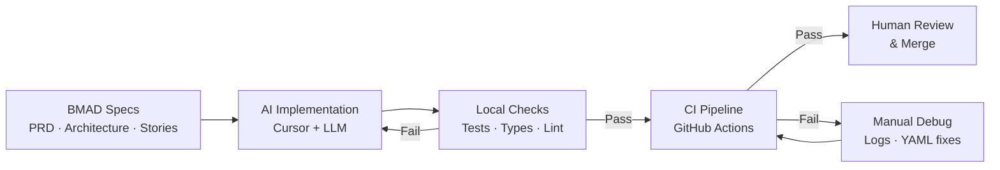

# AI Integration Log

> Written by Jose · Reviewed and refined by Paige (BMAD Tech Writer agent) · April 2026

This document covers how AI tooling was used throughout the project: what worked, what didn't, and where human judgment was still the deciding factor.

## Workflow at a Glance

## What AI Did (and Didn't Do)

AI assisted with nearly every phase of this project — planning, [architecture](./architecture-api.md), [API implementation](./api-contracts-api.md), [frontend](./architecture-web.md), testing, Docker, and documentation. The exceptions were narrow: some CSS adjustments, persistent type and linting errors that the model kept failing to resolve on its own, and parts of the [CI pipeline](./ci.md) configuration that required hands-on debugging.

## Tools and Models

**Cursor** was the primary environment. Most of the implementation used **Claude 3.5 Haiku** and **Gemini 2.0 Flash** (fast, low-cost models suited to routine code generation). **Claude Opus** (high-reasoning tier) was used for trickier bits.

A handful of stories were executed with **Claude Code** (agentic CLI). It produced good results but burned through token budgets quickly.

## Prompting Patterns

The single most effective habit was anchoring the model to the project's own definition of done. The prompt pattern that consistently worked was: *read the story file, implement it, then verify that tests pass, types check, and the linter is clean before declaring the task complete*.

Without that explicit reminder, the model would regularly produce code that looked correct but left behind failing tests, unused imports, or type errors.

## MCP Server Usage

**Playwright MCP** and **Chrome DevTools MCP** were both enabled. In practice, they were used for spot-checking rendered UI and verifying layout behavior rather than as core parts of the workflow.

## Test Generation

AI generated all initial test code in this project, with minor human adjustments during CI debugging.

The default QA agent produced mediocre output. The BMAD Test Architect agent was significantly better. It identified meaningful coverage gaps, wrote tests that exercised real behavior, and produced the axe-core [accessibility quality gate](./a11y-lighthouse-review.md) and the k6 performance scripts.

## Debugging

Not much debugging done to be honest — the app itself "just worked."

Where things broke down was **CI/CD**. GitHub Actions workflows, Playwright installation in CI, environment variable wiring, and build artifact paths all required manual debugging (see [CI documentation](./ci.md) and the [secrets checklist](./ci-secrets-checklist.md)). AI could suggest fixes but rarely understood the full CI context: what ran before the current step, what the runner's filesystem looked like, or why a working local setup failed in the pipeline. Most CI fixes came from reading logs, adjusting the workflow YAML by hand, and re-running.

## Where AI Fell Short

The most common failure mode was **"looks right, fails in CI"**. The model would produce code that passed local checks but introduced problems only visible in the pipeline: unused variables the local linter didn't catch in the same pass, test assertions that depended on timing, or import paths that worked in dev but broke in the production build.

A second recurring issue was **forgetting downstream effects**. After changing a component's props or a hook's return type, the model would update the source file but leave stale tests, outdated snapshots, or broken consumers untouched. This required constant vigilance — every change needed a follow-up prompt to verify that nothing else was left broken.

## Honest Take on BMAD

BMAD delivered on its promise: the PRD, architecture doc, UX spec, epics, and stories gave the AI agents enough context to produce working code with minimal back-and-forth. The structured artifacts meant less time explaining intent and more time reviewing output.

That said, the framework is heavy for a solo developer on a small project. The overhead of maintaining planning artifacts, story files, sprint tracking, and test design documents is clearly designed for a team where multiple people (or agents) need shared context. On a larger project with a proper cross-functional team, the investment may pay off — the specs would prevent the kind of drift and miscommunication that kills bigger efforts.

## Bottom Line

AI can carry the bulk of implementation when it has clear specs to work from and a tight feedback loop (tests, types, lint) to catch its mistakes. The parts it still struggles with — CI plumbing, downstream ripple effects, and anything that requires understanding state outside the current file — are exactly the parts where human judgment earns its keep. Plan well, verify relentlessly, and don't trust "it compiles" as a proxy for "it works."
