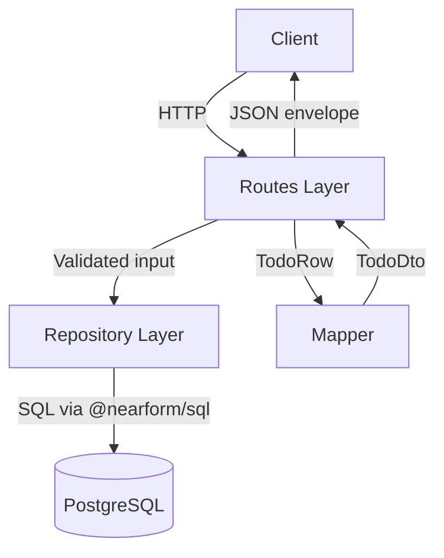
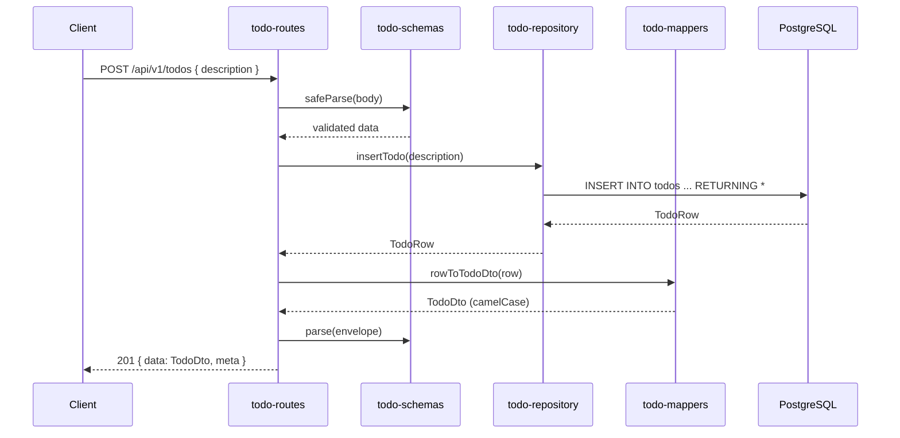

# Architecture — API Service

## Overview

Stateless REST API built with Fastify 5, serving the Todo domain over JSON. Connects to PostgreSQL 16 using raw parameterized SQL (`@nearform/sql`). Runs database migrations on startup via Postgrator.

## Technology Stack

| Category | Technology | Version |
|----------|-----------|---------|
| Runtime | Node.js | ≥ 18 |
| Framework | Fastify | 5.2.1 |
| Database driver | pg | 8.14.1 |
| Query builder | @nearform/sql | 1.10.7 |
| Migrations | Postgrator | 8.0.0 |
| Validation | Zod | 4 |
| CORS | @fastify/cors | 11.2.0 |
| Testing | Vitest | 3.1.1 |
| Language | TypeScript | 5.9.2 |

## Architecture Pattern

**Layered feature-first** — each domain feature is a self-contained directory containing routes, schemas, repository, and mappers. Shared infrastructure (database, HTTP utilities) lives under `shared/`.



## Key Design Decisions

### No ORM
All queries use `@nearform/sql` with parameterized SQL. This ensures full control over query performance and avoids the abstraction penalties of an ORM. Every query explicitly lists its columns in `RETURNING` clauses.

### Repository Pattern
Data access is encapsulated in a `TodoRepository` type with a factory function `createTodoRepository()`. The server accepts an optional repository override for testing, enabling easy mocking without modifying production code.

### snake_case → camelCase Mapping
Database columns use `snake_case` (`is_completed`, `created_at`). The mapper layer converts to `camelCase` (`isCompleted`, `createdAt`) before serialization. No DB column names ever appear in API responses.

### Error Envelope
All errors return a standardized `{ error: { code, message, requestId, details? } }` structure via `toErrorBody()`. HTTP 500 errors suppress the real message and return a generic string.

### Zod at Every Boundary
- Inbound: request body and path parameters are validated with Zod schemas
- Outbound: response payloads are validated through Zod `parse()` before sending
- This double-validation catches both client input errors and internal data integrity issues

### Health Checks
Two endpoints support container orchestration:
- `/healthz/live` — no dependencies, confirms the process is running
- `/healthz/ready` — verifies PostgreSQL connectivity with `SELECT 1`

## Source Structure

```
apps/api/
├── migrations/                  # Postgrator SQL files
├── src/
│   ├── features/todos/          # Domain feature
│   │   ├── todo-routes.ts       # HTTP handlers (POST, GET, PATCH, DELETE)
│   │   ├── todo-schemas.ts      # Zod schemas for validation
│   │   ├── todo-repository.ts   # Data access (SQL queries)
│   │   ├── todo-mappers.ts      # Row → DTO transformation
│   │   └── *.test.ts            # Co-located tests
│   ├── shared/
│   │   ├── db/pool.ts           # Singleton pg.Pool
│   │   ├── db/migration-runner.ts
│   │   └── http/error-envelope.ts
│   ├── index.ts                 # Entry: migrations → server → listen
│   └── server.ts                # createServer(): CORS, error handler, routes
└── package.json
```

## Data Flow



## Testing Approach

| Type | Tool | Scope |
|------|------|-------|
| Unit | Vitest | Schema validation, mapper logic, error envelope |
| Route | Vitest + Fastify inject | HTTP handlers with mocked repository |
| Integration | Vitest + real PostgreSQL | Full stack through actual database |

The `createServer({ todoRepository })` dependency injection makes it straightforward to test routes with a mock repository while keeping integration tests that hit a real database.
