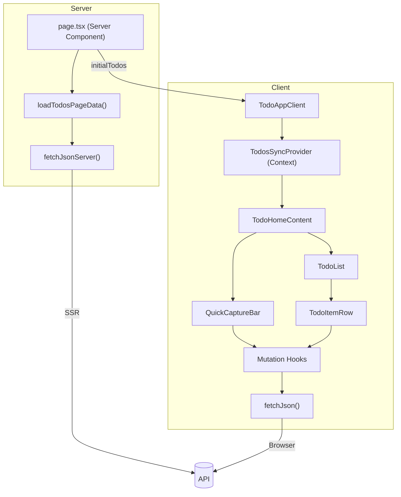
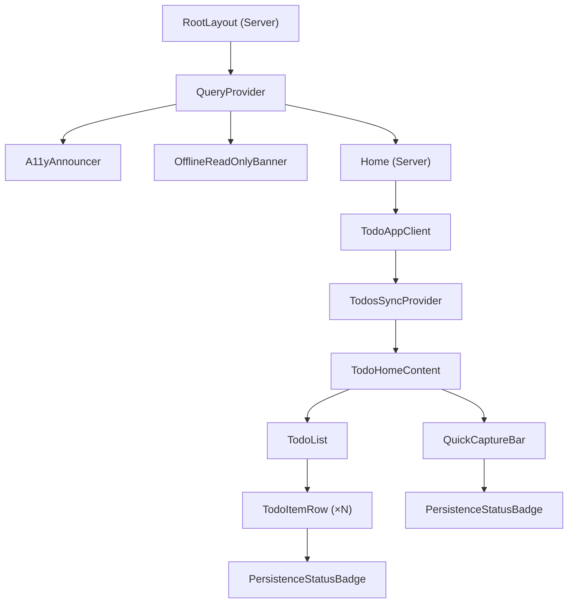

# Architecture — Web Frontend

## Overview

Server-rendered React application built with Next.js 16 (App Router). The home page SSR-loads todos from the API, then hydrates a client-side interactive app with optimistic state management via React Context and TanStack Query mutations.

## Technology Stack

| Category | Technology | Version |
|----------|-----------|---------|
| Framework | Next.js (App Router) | 16.2.2 |
| UI Library | React | 19.2.4 |
| Server state | TanStack Query | 5.95.2 |
| Forms | React Hook Form + @hookform/resolvers | 7.72.0 / 5.2.2 |
| Validation | Zod | 4 |
| Styling | Tailwind CSS | 4 |
| Unit testing | Vitest + Testing Library | 3.2.4 |
| E2E testing | Playwright | 1.59.1 |
| Accessibility | @axe-core/playwright | 4.11.1 |
| Language | TypeScript | 5.9.2 |

## Architecture Pattern

**Feature-first with Server Component root** — the page is a Server Component that fetches data, passing it as props to a Client Component tree that handles interactivity.



## Key Design Decisions

### Dual API Client
Two fetch wrappers serve different contexts:
- `fetchJsonServer()` — marked `server-only`, uses `API_BASE_URL` (internal Docker network in production), adds `cache: "no-store"` for fresh SSR data
- `fetchJson()` — runs in the browser, uses `NEXT_PUBLIC_API_BASE_URL` (public-facing URL)

Both validate responses with Zod schemas and transform HTTP errors into structured `ApiError` objects.

### TodosSyncContext (Optimistic Updates)
Instead of TanStack Query cache invalidation, a React Context (`TodosSyncProvider`) holds the todo list state. Mutation hooks call context methods (`prependTodo`, `updateTodo`, `removeTodo`) on success, providing instant UI feedback without a network round-trip for the list refresh.

Server-loaded todos are passed as `initialTodos` and synchronized via `useEffect` on the initial render.

### Persistence Status Lifecycle
Every mutation displays an explicit status: `saving` → `saved` → (auto-hide after 3s) or `error` (with inline retry). The `usePersistenceStatus` hook manages this state machine. The UI never "fakes" success — it waits for the API response.

### Offline Read-Only Mode
`useConnectivity()` hooks into TanStack Query's `onlineManager` to detect connectivity. When offline:
- A sticky banner appears at the top
- All mutation buttons are disabled (`isReadOnly`)
- Screen reader announcements fire on connectivity changes

### Accessibility
- `A11yAnnouncer` — a global `aria-live="polite"` region that announces actions (task added, task deleted, errors) to screen readers
- All interactive elements have `aria-label`, `aria-describedby`, and `aria-invalid` attributes
- Focus management after deletion (moves to the next item or back to the input)
- Keyboard navigation is fully supported
- E2E accessibility tests run axe-core on every page

### Form Validation
The quick-capture form uses React Hook Form with a Zod resolver. Client-side validation happens before the mutation fires. Server-side validation errors from the API are displayed inline.

## Source Structure

```
apps/web/src/
├── app/                           # Next.js App Router
│   ├── layout.tsx                 # Root: providers, A11yAnnouncer, OfflineBanner
│   ├── page.tsx                   # SSR home page
│   ├── query-provider.tsx         # TanStack QueryClient setup
│   └── healthz/route.ts           # Liveness probe
├── features/todos/
│   ├── components/                # Todo UI components
│   │   ├── todo-app-client.tsx    # Client boundary + sync provider
│   │   ├── todo-home-content.tsx  # QuickCapture + TodoList orchestration
│   │   ├── quick-capture-bar.tsx  # Create form with RHF + Zod
│   │   ├── todo-list.tsx          # List rendering, empty/error states
│   │   ├── todo-item-row.tsx      # Item with toggle, delete, retry
│   │   ├── todos-sync-context.tsx # State context for optimistic updates
│   │   └── persistence-status-badge.tsx
│   ├── hooks/                     # TanStack Query mutation hooks
│   ├── server/load-todos.ts       # SSR data loader
│   └── capture-schema.ts          # Zod form schema
└── shared/
    ├── api/                       # API client layer
    │   ├── fetch-json.ts          # Browser fetch wrapper
    │   ├── fetch-json-server.ts   # SSR fetch wrapper (server-only)
    │   ├── api-error.ts           # Custom error class
    │   ├── schemas.ts             # Zod schemas (shared with API contract)
    │   └── env.ts                 # URL resolution
    ├── hooks/use-connectivity.ts  # Online/offline detection
    └── ui/                        # Reusable UI primitives
        ├── error-message.tsx
        ├── loading-state.tsx
        ├── a11y-announcer.tsx
        └── offline-read-only-banner.tsx
```

## Component Hierarchy



## Testing Strategy

| Type | Tool | Focus |
|------|------|-------|
| Component | Vitest + Testing Library | Rendering, user interactions, error states, a11y attributes |
| Hook | Vitest | Mutation logic, persistence status state machine |
| E2E | Playwright | Full user flows (create, toggle, delete, offline behavior) |
| Accessibility | axe-core + Playwright | WCAG violations on all page states |
| Performance | Lighthouse CI + k6 | Core Web Vitals and API latency budgets |
