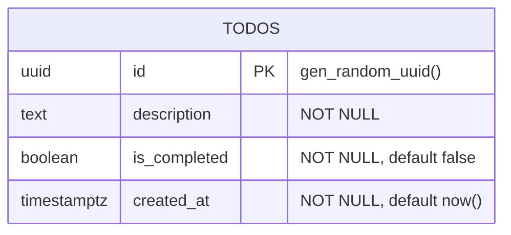

# Data Models — API Service

## Database

- **Engine:** PostgreSQL 16 (Alpine)
- **Connection:** `pg.Pool` singleton, initialized lazily from `DATABASE_URL`
- **Query builder:** `@nearform/sql` — parameterized SQL only, no ORM
- **Migrations:** Postgrator (file-based, `NNN.do.*.sql` / `NNN.undo.*.sql`)

---

## Tables

### todos

The single domain table for the application.

| Column | Type | Constraints | Default |
|--------|------|------------|---------|
| `id` | `UUID` | `PRIMARY KEY` | `gen_random_uuid()` |
| `description` | `TEXT` | `NOT NULL` | — |
| `is_completed` | `BOOLEAN` | `NOT NULL` | `false` |
| `created_at` | `TIMESTAMPTZ` | `NOT NULL` | `now()` |

**Indexes:**

| Index | Column(s) | Purpose |
|-------|-----------|---------|
| `todos_pkey` | `id` | Primary key (implicit) |
| `idx_todos_created_at` | `created_at` | Supports ORDER BY in list query |

**Migration History:**

| Version | File | Action |
|---------|------|--------|
| 001 | `001.do.create-todos.sql` | Creates `todos` table |
| 001 | `001.undo.create-todos.sql` | Drops `todos` table |
| 002 | `002.do.add-todos-indexes.sql` | Adds `idx_todos_created_at` index |
| 002 | `002.undo.add-todos-indexes.sql` | Drops the index |

---

## Data Access Layer

Repository pattern implemented in `apps/api/src/features/todos/todo-repository.ts`.

| Method | SQL Operation | Returns |
|--------|--------------|---------|
| `insertTodo(description)` | `INSERT INTO todos ... RETURNING *` | `TodoRow` |
| `findAllTodosOrderedByCreatedAtDesc()` | `SELECT ... ORDER BY created_at DESC` | `TodoRow[]` |
| `updateTodoCompletion(id, isCompleted)` | `UPDATE todos SET is_completed ... WHERE id ... RETURNING *` | `TodoRow \| null` |
| `deleteTodo(id)` | `DELETE FROM todos WHERE id` | `boolean` |

### Row Type (`TodoRow`)

```typescript
type TodoRow = {
  id: string;
  description: string;
  is_completed: boolean;   // snake_case from DB
  created_at: Date;
};
```

### DTO Mapping

The mapper in `todo-mappers.ts` converts `TodoRow` (snake_case) to `TodoDto` (camelCase) for the API response:

```
TodoRow.is_completed → TodoDto.isCompleted
TodoRow.created_at   → TodoDto.createdAt (ISO 8601 string)
```

No `snake_case` fields ever appear in API responses.

---

## Schema Tracking

The Postgrator schema version table is named `schemaversion` (configured in `migration-runner.ts`). It tracks which migrations have been applied.

---

## Entity Relationship Diagram



Currently a single-table schema. No foreign keys or relationships.
