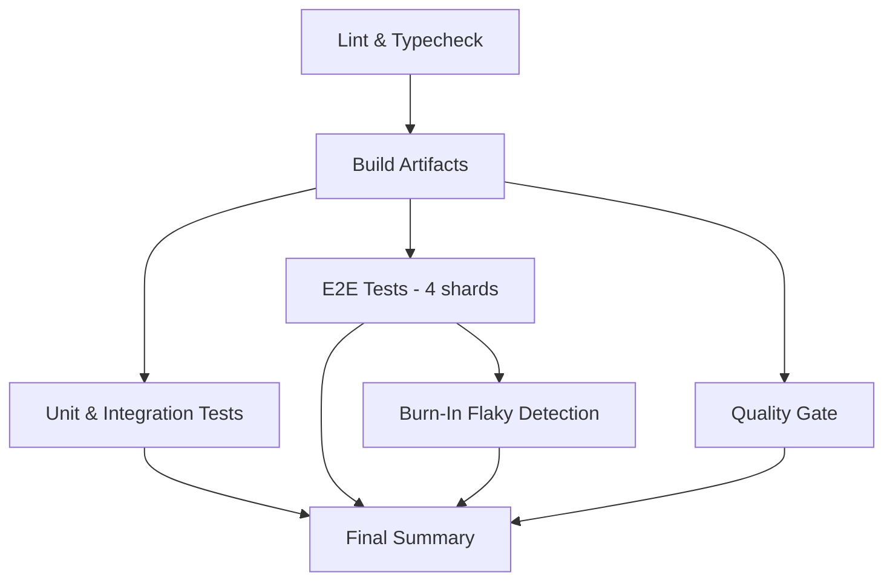

# Deployment Guide

## Containerization

Both apps have Dockerfiles and are orchestrated via `docker-compose.yml`.

### Services

| Service | Image / Build | Port | Depends On |
|---------|--------------|------|------------|
| `postgres` | `postgres:16-alpine` | 5432 | — |
| `postgres_test` | `postgres:16-alpine` (profile: `test`) | 5433 | — |
| `api` | Built from `apps/api/Dockerfile` | 3001 | postgres (healthy) |
| `web` | Built from `apps/web/Dockerfile` | 3000 | api (healthy) |

### Startup Order


Each service uses health checks to gate the next:
- **postgres:** `pg_isready` every 5s
- **api:** `GET /healthz/live` every 10s (start period: 20s)
- **web:** `GET /healthz` every 15s (start period: 40s)

### Docker Networking

All services share a `bridge` network named `app`. The web container calls the API via internal hostname: `http://api:${API_PORT}` (set as `API_BASE_URL`). Browser requests use the public `NEXT_PUBLIC_API_BASE_URL`.

### Volumes

| Volume | Purpose |
|--------|---------|
| `postgres_data` | Persists development database between restarts |
| `postgres_test_data` | Persists test database |

## Production Deployment

### Build

```bash
pnpm turbo run build
```

Produces:
- API: `apps/api/dist/` (compiled TypeScript)
- Web: `apps/web/.next/` (Next.js production build)

### Environment Configuration

Production requires:
- `DATABASE_URL` pointing to a managed PostgreSQL instance
- `NEXT_PUBLIC_API_BASE_URL` set to the public HTTPS API URL
- `API_BASE_URL` set to the internal API URL (if running behind a reverse proxy)
- `CORS_ORIGIN` set to the production web domain(s)

### Security Considerations

- Terminate TLS at the load balancer / edge — `NEXT_PUBLIC_API_BASE_URL` must be `https://` in production
- The API never exposes internal stack traces (500 errors return a generic message)
- All SQL queries use parameterized `@nearform/sql` — no string interpolation
- CORS is restricted to explicitly configured origins

### Database Migrations

Migrations run automatically on API startup. In production environments where auto-migration is undesirable, run them as a pre-deploy step:

```bash
DATABASE_URL=<production-url> pnpm --filter api migrate
```

## CI/CD Pipeline

GitHub Actions (`.github/workflows/test.yml`) runs on push to `main`/`develop` and on pull requests.

### Pipeline Stages



| Job | Timeout | Description |
|-----|---------|-------------|
| **lint** | 10 min | ESLint + TypeScript `--noEmit` |
| **build** | 15 min | Turborepo production build (depends on lint) |
| **test-unit** | 15 min | Vitest with coverage + real PostgreSQL service |
| **test-e2e** | 30 min | Playwright (4 parallel shards, Chromium only) |
| **burn-in** | 60 min | Re-runs changed E2E specs 5x to detect flakiness (PRs only) |
| **quality-gate** | — | axe-core a11y + Lighthouse CI + k6 performance with budget checks |
| **report** | — | Aggregates all job results into a summary table |

### CI Services

A PostgreSQL 16 service container runs alongside test jobs (port 5432, credentials `todo:todo`).

### Caching

- **Turbo cache:** `.turbo` directory cached by `runner.os + SHA`
- **pnpm store:** Cached via `actions/setup-node` built-in caching
- **Playwright browsers:** Cached by `pnpm-lock.yaml` hash

### Performance Budget Enforcement

The quality gate job runs k6 against `perf/k6/api-read-scenarios.js` and compares the p95 latency against thresholds defined in `perf/budgets/api-budgets.json`. The pipeline fails if the budget is exceeded.
