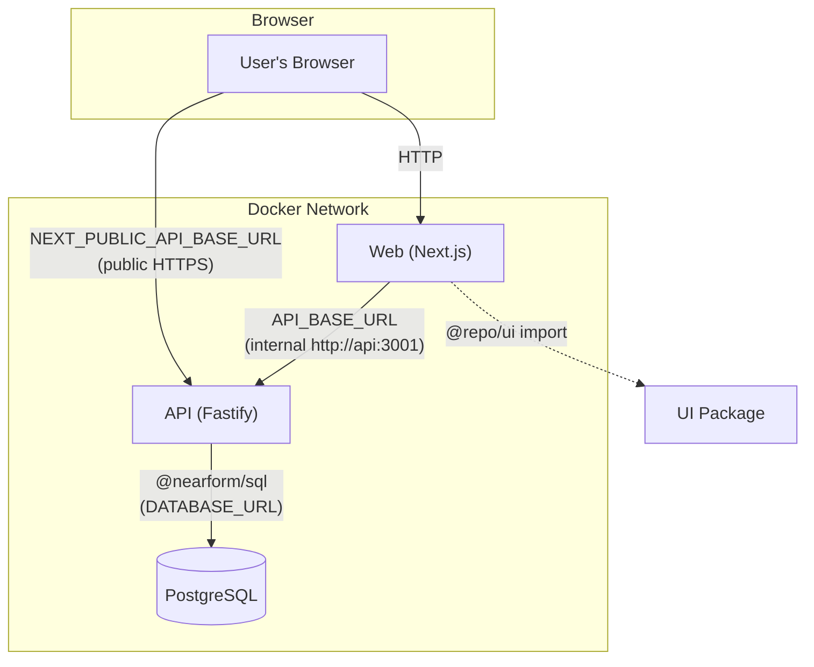

# Integration Architecture

## Overview

The monorepo has three parts that integrate through HTTP REST calls and package imports.

## Integration Map



## Integration Points

### Web → API (Server-Side Rendering)

| Attribute | Value |
|-----------|-------|
| **From** | `apps/web` (Server Component / `load-todos.ts`) |
| **To** | `apps/api` |
| **Protocol** | HTTP REST (JSON) |
| **Client** | `fetchJsonServer()` (`server-only` module) |
| **Base URL** | `API_BASE_URL` env var (defaults to `NEXT_PUBLIC_API_BASE_URL`) |
| **Usage** | SSR data loading on page render |
| **Validation** | Response validated with Zod `listTodosResponseSchema` |

In Docker Compose, the web service sets `API_BASE_URL=http://api:${API_PORT}` to route SSR calls through the internal Docker network, avoiding the public URL and reducing latency.

### Web → API (Client-Side Mutations)

| Attribute | Value |
|-----------|-------|
| **From** | `apps/web` (Browser, mutation hooks) |
| **To** | `apps/api` |
| **Protocol** | HTTP REST (JSON) |
| **Client** | `fetchJson()` |
| **Base URL** | `NEXT_PUBLIC_API_BASE_URL` env var |
| **Operations** | `POST /api/v1/todos`, `PATCH /api/v1/todos/:id`, `DELETE /api/v1/todos/:id` |
| **Validation** | Request bodies validated client-side (Zod + RHF); responses validated with Zod schemas |

### API → PostgreSQL

| Attribute | Value |
|-----------|-------|
| **From** | `apps/api` (`todo-repository.ts`, `pool.ts`) |
| **To** | PostgreSQL 16 |
| **Protocol** | TCP (libpq) |
| **Client** | `pg.Pool` singleton |
| **Query builder** | `@nearform/sql` (parameterized queries) |
| **Connection** | `DATABASE_URL` env var |

### Web → UI Package

| Attribute | Value |
|-----------|-------|
| **From** | `apps/web` |
| **To** | `packages/ui` |
| **Protocol** | TypeScript module import |
| **Import path** | `@repo/ui/<component>` |
| **Consumed** | Button, Card, Code components |

## Shared Contracts

The API and Web share a common understanding of the response shape, though they maintain separate Zod schema definitions:

| Schema | API Location | Web Location |
|--------|-------------|--------------|
| `todoDtoSchema` | `todo-schemas.ts` | `shared/api/schemas.ts` |
| `errorEnvelopeSchema` | `todo-schemas.ts` | `shared/api/schemas.ts` |

These are not shared as a package — they are duplicated by design so each app validates independently at its boundary.

## CORS Configuration

The API restricts cross-origin requests to origins listed in `CORS_ORIGIN` (comma-separated). In development, this defaults to `http://localhost:3000`. In production, it must match the deployed web app's domain.

## Network Topology (Docker Compose)

```
┌──────────────────────────────────────────────┐
│  Docker bridge network: app                   │
│                                               │
│  ┌──────────┐   ┌──────────┐   ┌──────────┐ │
│  │ postgres │   │   api    │   │   web    │ │
│  │ :5432    │◄──│ :3001    │◄──│ :3000    │ │
│  └──────────┘   └──────────┘   └──────────┘ │
└──────────────────────────────────────────────┘
         ▲                              ▲
         │                              │
    (DATABASE_URL)              (Host ports mapped)
                                        │
                                   ┌─────────┐
                                   │ Browser  │
                                   └─────────┘
```
